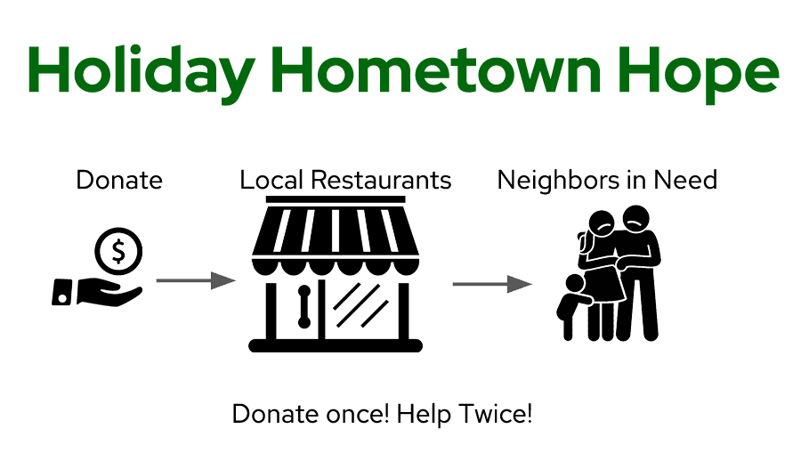

# Holiday 2020 Hometown Hope

COVID has severely impacted many families in our community.  At the same time, many local businesses and restaurants are struggling to survive.

F3 Churham is raising money to provide restaurant gift certificates for families in need this holiday season.  By giving gift certificates to local restaurants, this is a unique opportunity to double your impact on our community.  Every dollar you donate helps twice.  It helps a local restaurant and a family in need.

---

**Who is raising the money?**

This fundraiser is started by the [F3 community](f3churham.com). F3 is a free, peer-led workout group of guys that meet all over the state and far beyond.

**Where is the money going?**

The money is going to buy gift cards from local struggling restaurants in the Chapel-Hill and Durham metro area.  And, we are working with local community organizations to distribute them to struggling families.  So, every dollar you donate helps our community twice!

## Two fundraising campaigns, One Goal!

* [F3 Fundraising contest](#f3-fundraising-contest)
* [Chatham - Orange - Durham Community Members](#chatham---orange---durham-community-members)

---
## F3 Fundraising contest

If you are a member of the F3 community click the link below!

[Click here to join the F3 fundraising contest!](https://givebutter.com/churham)

---

## Chatham - Orange - Durham Community Members

If you just want to help raise money but are not part of the F3 community (or a spouse, neighbor, etc) you can still help us raise money!  This event and fundraiser is open to everyone!

[Click here to raise money for the community](https://givebutter.com/holiday_hope_everyone)
